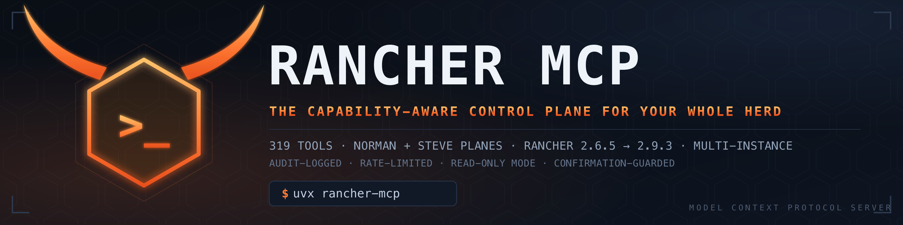
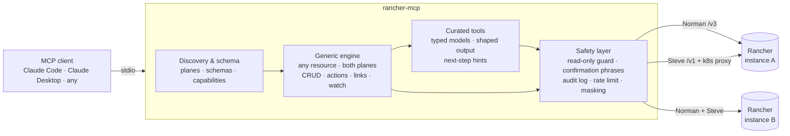

<p align="center">
  
</p>

<p align="center">
  <a href="https://modelcontextprotocol.io"></a>
  <a href="docs/tool-manifest.json"></a>
  <a href="https://www.python.org/"></a>
  
  
  <a href="https://github.com/microsoft/pyright"></a>
  <a href="LICENSE"></a>
</p>

<p align="center">
  <b>319 tools</b> for operating Rancher-managed Kubernetes through any MCP client —
  discovery, generic resource access, and curated operator workflows,
  wrapped in an audit-logged, rate-limited, confirmation-guarded safety model.
</p>

<p align="center">
  <a href="#quick-start">Quick start</a> ·
  <a href="#the-tool-surface">Tool surface</a> ·
  <a href="#architecture">Architecture</a> ·
  <a href="#safety-model">Safety model</a> ·
  <a href="#compatibility">Compatibility</a> ·
  <a href="#development">Development</a>
</p>

---

## Why this exists

Rancher is how real fleets run Kubernetes — and it speaks **two APIs** (the legacy
Norman `/v3` plane and the modern Steve `/v1` plane), varies by version, and wraps
every cluster behind its own proxy. Pointing a generic Kubernetes MCP server at it
misses everything Rancher-specific; pointing an agent at raw `kubectl` gives up
auditability, guardrails, and the management-plane view entirely.

**Rancher MCP** is built for that reality:

- **Capability-aware, not version-naive.** It detects what each connected Rancher
  actually supports instead of assuming. One binary spans **2.6.5 → 2.9.3** with
  the same tool surface.
- **Multi-instance first.** Lab, staging, prod — configure them all; mark prod
  `read_only: true` and every mutation is refused at the config layer, before any
  guard even has to fire.
- **Nothing is out of reach.** Curated tools cover the common 95%; the generic
  engine reaches *every* resource either API plane exposes — even types nobody
  wrote a tool for yet.

## The tool surface

**319 tools: 176 read-only · 143 writes · 38 destructive** — counted from the
registry itself, not by hand. [`docs/tool-manifest.json`](docs/tool-manifest.json)
is **generated from the live FastMCP registry** (`make tool-manifest`) and a CI
gate fails the build if it ever drifts from the code. Per-tool descriptions,
safety annotations, and parameters all live there; the narrative registry with
slice tracking is [`docs/tool-catalog.md`](docs/tool-catalog.md).

| Layer | What it does | Examples |
|---|---|---|
| **Discovery & schema** | Explore what any instance can do | `rancher_server_version`, `rancher_norman_schema_list`, `rancher_capability_domain_list` |
| **Generic engine** | CRUD + actions + links + watch on *any* resource, both planes | `rancher_steve_resource_list`, `rancher_norman_resource_action_invoke`, `rancher_steve_resource_watch` |
| **Curated reads** | Typed, shaped responses across ~25 domains | `rancher_pods_list`, `rancher_deployments_list`, `rancher_longhorn_volumes_list`, `rancher_policy_reports_list` |
| **Curated writes** | Guarded mutations | `rancher_deployment_scale`, `rancher_deployment_restart`, `rancher_cron_job_suspend`, `rancher_node_cordon`, `rancher_secret_create` |
| **Operator rollups** | One-call triage | `rancher_cluster_health_check`, `rancher_find_failing_pods`, `rancher_find_stalled_rollouts`, `rancher_project_health_summary` |

Domains covered: clusters & nodes · projects & namespaces · workloads · pods &
services · storage · networking · config & secrets *(values masked)* ·
certificates *(keys masked)* · RBAC · auth & identity · apps & catalogs ·
logging pipeline · Prometheus monitoring · policy reports · CIS compliance ·
backup operator · etcd backups · Longhorn · Fleet · provisioning · settings &
features · alerts & notifiers.

## Quick start

### Requirements

- Python 3.12+ and [uv](https://docs.astral.sh/uv/)
- A Rancher API token ([creating one](https://ranchermanager.docs.rancher.com/reference-guides/user-settings/api-keys))

### Install & run

```bash
# From source
git clone https://github.com/rex/mcp-rancher.git
cd mcp-rancher
make setup                 # deps, .env scaffold, pre-commit hooks
cp .env.example .env       # set RANCHER_URL + RANCHER_TOKEN
make dev                   # run the MCP server (stdio)
```

Once published to PyPI, it's one line: `uvx rancher-mcp`.

### Claude Code

```bash
claude mcp add rancher \
  -e RANCHER_URL=https://rancher.example.com \
  -e RANCHER_TOKEN=token-xxxxx:yyyyyyyyy \
  -- uv run --directory /path/to/mcp-rancher rancher-mcp
```

### Claude Desktop

```json
{
  "mcpServers": {
    "rancher": {
      "command": "uv",
      "args": ["run", "--directory", "/path/to/mcp-rancher", "rancher-mcp"],
      "env": {
        "RANCHER_URL": "https://rancher.example.com",
        "RANCHER_TOKEN": "token-xxxxx:yyyyyyyyy"
      }
    }
  }
}
```

### Multiple instances

```env
RANCHER_INSTANCES_JSON='{
  "production": {"url": "https://rancher.prod.example.com",    "token": "token-a:xxx", "verify_ssl": true, "read_only": true},
  "lab":        {"url": "https://rancher.lab.example.com",     "token": "token-b:yyy", "verify_ssl": false, "read_only": false}
}'
RANCHER_DEFAULT_INSTANCE=production
```

Every tool takes an optional `instance` argument. Instances flagged
`read_only: true` refuse **all** mutations at the settings layer.

## Architecture



Three layers, deliberately separate: **discovery** tells you what an instance can
do, the **generic engine** can touch anything it exposes, and **curated tools**
make the common paths typed, shaped, and self-describing (every response carries
`suggested_next_steps`). Most curated tools are **generated from YAML descriptors**
(`catalog/curated_tools/`) with a drift gate — the editorial decisions live in
descriptors, not boilerplate.

## Safety model

Built for the day an agent is pointed at the cluster that pays your salary:

| Guard | Behavior |
|---|---|
| **Read-only instances** | `read_only: true` refuses every mutation for that instance, before tool logic runs |
| **Destructive confirmation** | Deletes require an explicit typed phrase (e.g. `"delete steve namespace foo"`) — no phrase, no delete |
| **Tool annotations** | Every tool declares `readOnlyHint` / `destructiveHint` / `idempotentHint`, so clients can gate UX on them |
| **Audit log** | Every mutation emits a structured `event="audit"` record — tool, operation, plane, instance, resource, outcome. Argument *names* only; values never logged |
| **Rate limiting** | Token-bucket on writes (default 60/min) — a runaway loop can't machine-gun your API |
| **Secret & key masking** | Secret values and certificate private keys are structurally absent from curated responses (reveal is an explicit generic-tool opt-in) |
| **Structured errors** | Guard rejections return typed `error_code` envelopes agents can branch on — never raw strings |

## Compatibility

| | |
|---|---|
| **Primary target** | Rancher **2.9.3** (production-validated) |
| **Compatibility floor** | Rancher **2.6.5** (kept green via capability detection) |
| **API planes** | Norman `/v3` + Steve `/v1` (+ per-cluster Kubernetes proxy) |
| **Transport** | stdio |

Capability detection bridges version differences at runtime — no
version-pinned builds, no "works on my Rancher." Both targets are exercised by
the same test suite, and read paths have been validated live against both a
2.6.5 lab and a 2.9.3 production fleet
([validation report](docs/live-validation-2026-05-06.md)).

## Configuration

| Variable | Default | Purpose |
|---|---|---|
| `RANCHER_URL` | — | Rancher server URL (single-instance mode) |
| `RANCHER_TOKEN` | — | API token (`token-xxxxx:yyyyyyyyy`) |
| `RANCHER_VERIFY_SSL` | `true` | TLS verification |
| `RANCHER_INSTANCES_JSON` | — | Multi-instance config (see above) |
| `RANCHER_DEFAULT_INSTANCE` | first defined | Instance used when a tool call names none |
| `RANCHER_MCP_SERVER_NAME` | `rancher-mcp` | Server identity announced to clients |
| `RANCHER_MCP_SERVER_DESCRIPTION` | built-in | Server description announced to clients |
| `RANCHER_MCP_WRITE_RATE_LIMIT_PER_MIN` | `60` | Write rate limit (`0` disables) |

## Project status

Shipping and stable for **read, triage, and guarded write** operations. Honest
ledger of what's beyond that:

- **Destructive workflows** (node drain, etcd/backup restore, cert rotation,
  cluster upgrade/delete) are **roadmap** — deliberately staged after real-world
  read-path mileage. The generic engine + confirmation guard already covers
  these cases for operators who need them today.
- The Alertmanager routes/silences surface needs an in-cluster API integration
  and is deferred.
- The full per-version compatibility matrix (Track G) is in progress; the
  [first live validation run](docs/live-validation-2026-05-06.md) covers the
  read matrix on both targets.

Work is tracked to the tool level: [`docs/tool-catalog.md`](docs/tool-catalog.md)
(every tool has a row, every gap a slice ID) and [`ROADMAP.md`](ROADMAP.md).

## Development

```bash
make help               # every target, documented
make validate           # codegen drift + manifest drift + architecture + lint + typecheck + tests
make tool-manifest      # regenerate docs/tool-manifest.json from the registry
make lab-up             # local Rancher 2.6.5 lab (kind + helm), fully scripted
make live-read-matrix   # read-only validation probes against configured instances
make mock-rancher       # fixture-backed mock Rancher for provider-config testing
```

- **Local lab** — a self-contained Rancher 2.6.5 on kind with a simulated
  downstream cluster; repo-local kubeconfigs, never touches your machine state.
- **Contract fixtures** — sanitized captures from live Rancher committed under
  `tests/fixtures/`; `respx` pins the HTTP boundary in tests.
- **Codegen** — curated tools are emitted from `catalog/curated_tools/*.yml`
  descriptors; `make check-codegen` fails on drift.
- **Gates** — ruff, pyright strict, 624 tests with coverage floor, architecture
  line-limits, module-shape checks, secret scanning. All fail closed, all wired
  into pre-commit.

Stack: Python 3.12 · [FastMCP](https://github.com/modelcontextprotocol/python-sdk) ·
[httpx](https://www.python-httpx.org/) · [Pydantic v2](https://docs.pydantic.dev/) ·
[structlog](https://www.structlog.org/) · [uv](https://docs.astral.sh/uv/)

## Security

See [SECURITY.md](SECURITY.md) for the threat model, token guidance, and how to
report vulnerabilities.

## License

[MIT](LICENSE)
